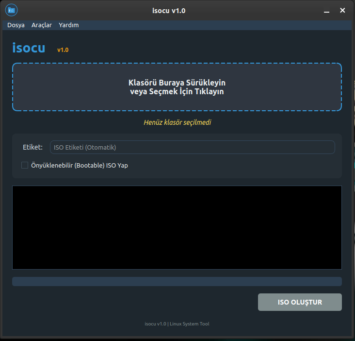
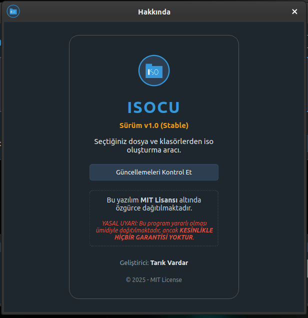

# 📀 isocu - Modern ISO Oluşturma Aracı


**isocu**, Linux (Pardus/Debian) sistemler için geliştirilmiş, klasör ve dosyalarınızı tek tıkla **ISO formatına** dönüştüren, modern arayüzlü ve kullanıcı dostu bir araçtır.

Özellikle Windows/Linux uyumluluğu (Joliet/RockRidge) ve büyük dosya desteği (UDF) ile standartların ötesinde bir çözüm sunar.

## 📸 Ekran Görüntüleri

| **Ana Ekran** | **Hakkında ve Güncelleme** |
|:---:|:---:|
|  |  |
| *Sürükle-Bırak destekli modern arayüz* | *Otomatik güncelleme kontrolü* |

## 🚀 Özellikler

* **📂 Akıllı İsimlendirme:** Türkçe karakter, boşluk veya parantez içeren dosya isimlerini bozmadan ISO standardına (ISO 9660) uygun hale getirir.
* **💾 Büyük Dosya Desteği (UDF 2.60):** 4 GB üzerindeki dosyaları (oyun setup dosyaları, veritabanı yedekleri vb.) sorunsuz işler.
* **📀 Bootable ISO:** Önyüklenebilir (Bootable) ISO oluşturma desteği.
* **🔐 Checksum Hesaplayıcı:** Oluşturulan ISO'nun doğruluğunu SHA256 ile kontrol etme aracı.
* **🖥️ Modern Arayüz:** PyQt6 ile geliştirilmiş, sürükle-bırak destekli, karanlık mod uyumlu (Dark Theme) şık tasarım.
* **🔄 Arkaplan İşlemleri:** ISO oluşturma sırasında arayüz donmaz, sistem tepsisine (System Tray) küçülebilir.
* **🐧 Linux & Windows Uyumu:** Oluşturulan ISO'lar hem Linux (Rock Ridge) hem de Windows (Joliet) sistemlerde sorunsuz çalışır.
* **⚡ Tek Pencere (Single Instance):** Uygulama zaten açıksa, ikinci kez tıklandığında yenisini açmaz, mevcut olanı öne getirir.

## 📦 Kurulum

### Yöntem 1: .deb Paketi ile Kurulum (Önerilen)
Releases sayfasından en son `.deb` paketini indirin ve kurun:
```bash
sudo dpkg -i isocu_1.0_amd64.deb
```

### Yöntem 2: Kaynak Koddan Çalıştırma
```bash
# 1. Depoyu klonlayın
git clone https://github.com/tvardar/isocu.git
cd isocu

# 2. Sanal ortam oluşturun ve aktif edin
python3 -m venv venv
source venv/bin/activate

# 3. Bağımlılıkları yükleyin
pip install -r requirements.txt

# 4. Çalıştırın
python3 main.py
```

## 🛠️ Kullanılan Teknolojiler
* **Python 3**
* **PyQt6** (GUI)
* **pycdlib** (ISO İşlemleri)
* **Pillow** (Görsel İşleme)
* **Requests** (Güncelleme Kontrolü)
* **PyInstaller** (Paketleme)

## ⚖️ Lisans
Bu proje **MIT Lisansı** ile lisanslanmıştır. Detaylar için [LICENSE](LICENSE) dosyasına bakabilirsiniz.

## 👨‍💻 Geliştirici
**Tarık Vardar** - [Web Sitesi](https://www.tarikvardar.com.tr) | [GitHub](https://github.com/tvardar)
